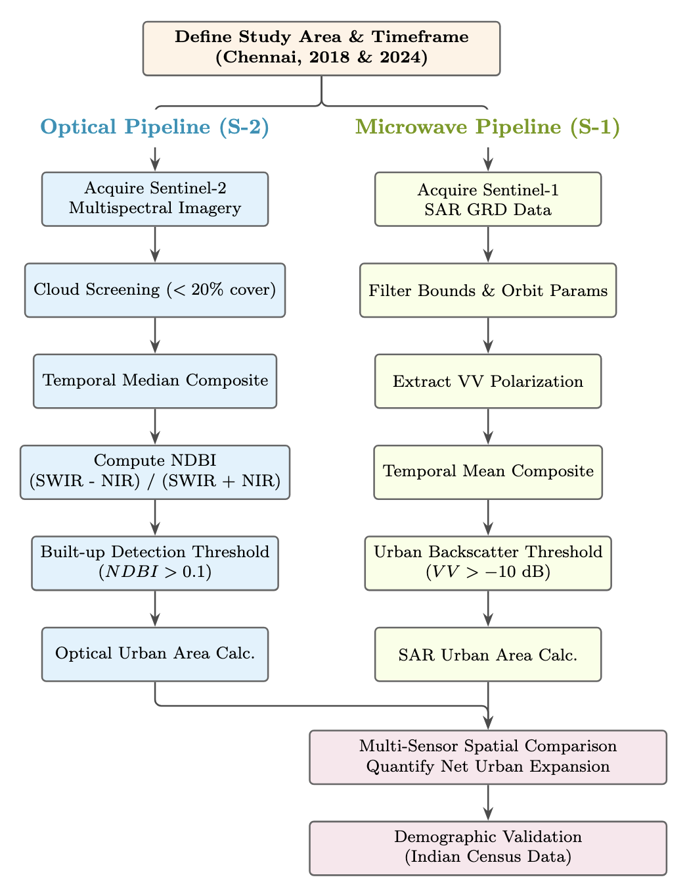
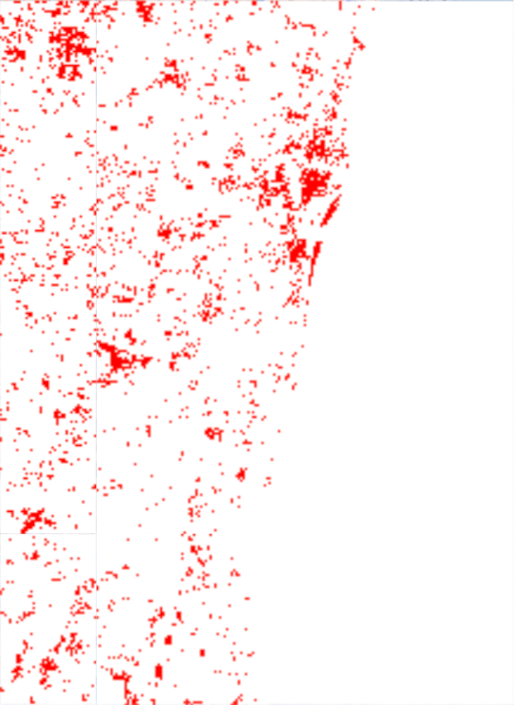
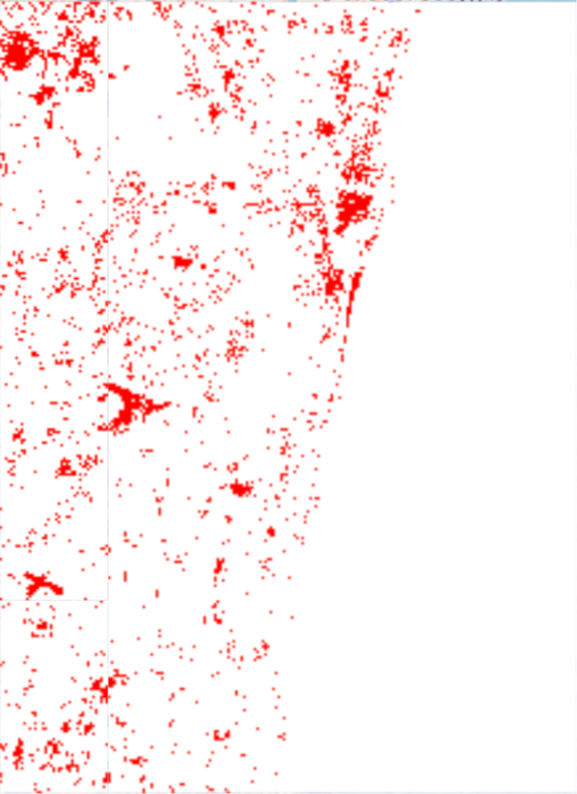
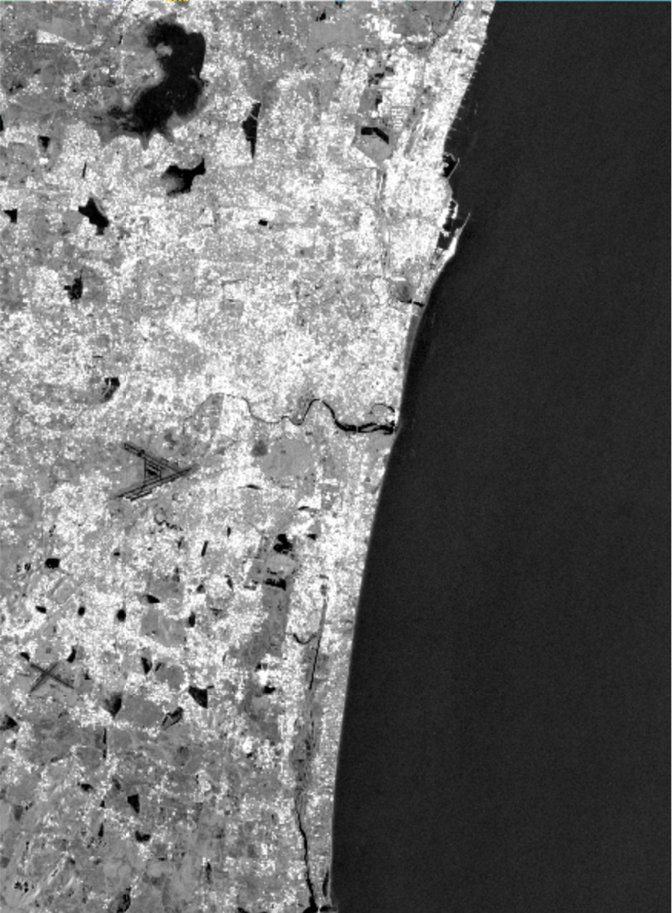
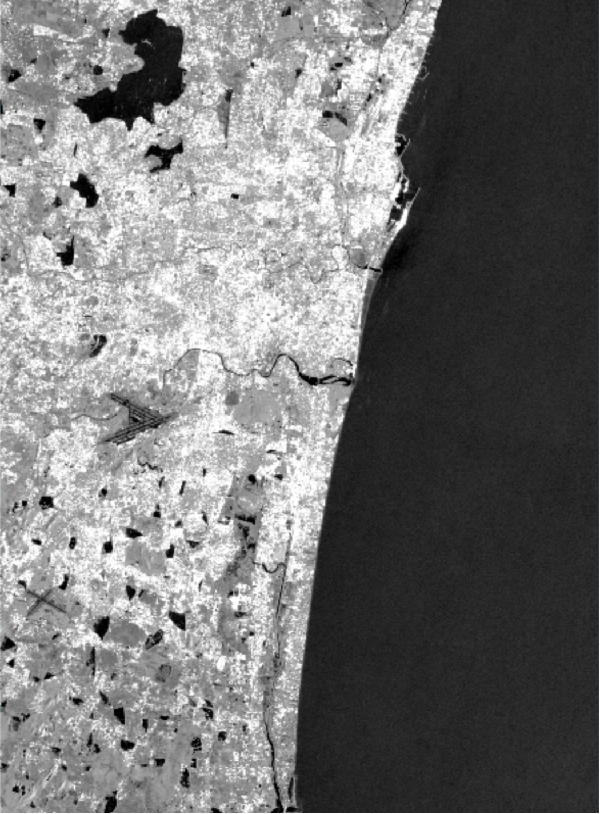
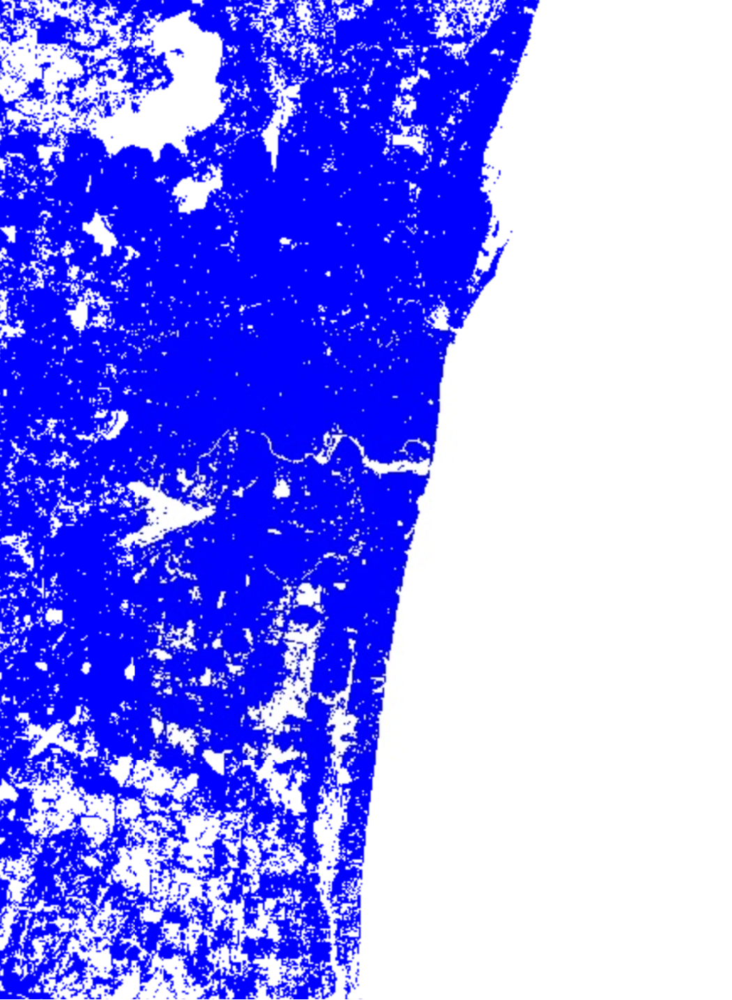
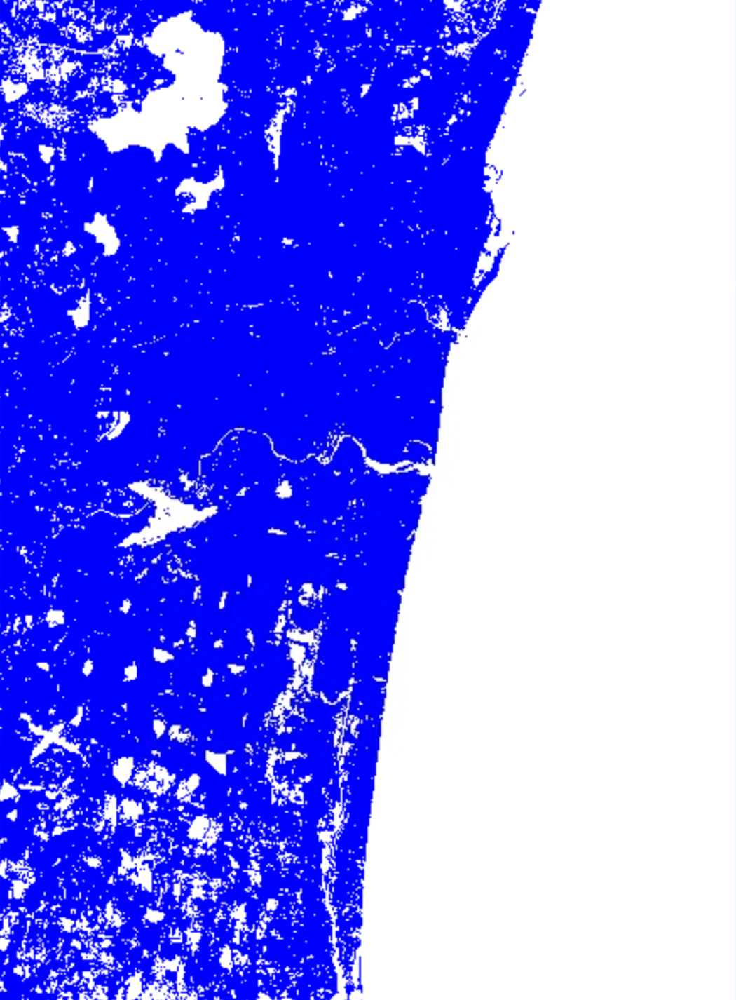

# Satellite-Based Urban Growth Analysis Using Sentinel-1/2 Data

## Abstract

Rapid urbanization in developing countries makes it important to monitor how cities expand so that planning and resource management can be done properly. This study analyzes the urban growth of Chennai, Tamil Nadu, India, over six years (2018–2024) using satellite remote sensing data. The study uses two types of satellite data from the Copernicus Sentinel satellites. Optical images from Sentinel-2 were used to identify built-up areas using the Normalized Difference Built-up Index (NDBI). Radar data from Sentinel-1 was used to study surface changes through backscatter analysis. The results show clear urban expansion in Chennai. The optical data detected about a 7.43 km² increase in built-up areas, while the radar data detected about 88.15 km² of surface development changes. Using both optical and radar data together helps provide a more complete understanding of urban growth. This shows that using multiple types of satellite data is useful for monitoring city expansion.

**Keywords:** Urban Growth, Remote Sensing, Sentinel-1, Sentinel-2, NDBI, SAR, Chennai, Multi-temporal Analysis

## Introduction

Urbanization is one of the major changes happening in the world today. More than half of the world's population now lives in cities. This change is especially great in developing countries, where economic growth and migration from rural areas to cities are causing cities to expand quickly. India is one of the fastest-growing economies, and many of its major cities are growing rapidly. In many cases, the physical growth of cities is happening faster than proper planning and administration.

Chennai, the capital city of Tamil Nadu, is the focus of this study. It is located on the southeastern coast of India along the Bay of Bengal. Chennai is the fourth-largest metropolitan city in India and is an important economic center in southern India. The city has grown a lot in population and physical size over the past few decades. This growth is mainly due to industries such as automobile manufacturing, information technology services, and port-related activities.

The study area covers the main Chennai metropolitan region, defined by the following geographic coordinates:
- **Latitude Range:** 12.80° - 13.20° North
- **Longitude Range:** 80.10° - 80.40° East
- **Total Area:** Approximately 1,200 km²
- **Administrative Boundaries:** Chennai Metropolitan Area (CMA)

This area includes the main city center and the nearby surrounding areas that are rapidly developing. Chennai's coastal location, flat land, and well-developed transport networks make it easy for the city to expand outward. Because of these conditions, it is a suitable area for studying urban growth using satellite data. The time period from 2018 to 2024 was chosen because several major infrastructure projects and government policies during this time have affected the pattern of urban development in the region.

## Data Sources

This study uses high-resolution satellite data from the European Space Agency's Copernicus Sentinel satellites. It uses two types of sensors, optical and microwave, which provide different kinds of information. Using data from both sensors helps in studying urban areas more completely because each sensor detects different physical characteristics of the surface.

| Satellite | Sensor Type | Resolution | Application |
|-----------|-------------|------------|-------------|
| Sentinel-2 | Optical Multispectral (MSI) | 10 m | Built-up detection via NDBI |
| Sentinel-1 | C-band SAR | 10 m (IW) | Surface roughness analysis |

### Sentinel-2 Optical Data

Sentinel-2 provides high-resolution multispectral images with 13 spectral bands that cover the visible, near infrared, and shortwave infrared parts of the electromagnetic spectrum. For urban analysis, this study uses band B8 (near infrared, 842 nm) and band B11 (shortwave infrared, 1610 nm) with a spatial resolution of 10 meters. During data collection, images with cloud coverage less than 20 percent were selected to ensure good image quality and consistency for the time period being studied.

### Sentinel-1 SAR Data

Sentinel-1 provides synthetic aperture radar (SAR) data using C-band microwave signals at a frequency of 5.405 GHz. It operates in interferometric wide swath (IW) mode and provides ground range detected (GRD) data with a spatial resolution of about 10 meters. For urban analysis, VV polarization (vertical transmit and vertical receive) is used because it helps detect urban surface roughness and structural features. The radar system can collect data in all weather conditions and does not depend on sunlight, allowing consistent data collection. Before analysis, the data is preprocessed using radiometric calibration, terrain correction, and speckle filtering to improve the quality of the radar backscatter data for urban detection.

## Methodology

The study uses a systematic method to analyze urban growth over time using both optical and microwave remote sensing data. The process includes data preprocessing, calculating indices, classification, and measuring the area of urban development for both types of satellite data. All satellite data processing and analysis were carried out using the Google Earth Engine cloud computing platform.



*Figure 1: Methodological workflow for multi-sensor urbanization analysis using optical (Sentinel-2) and microwave (Sentinel-1) remote sensing data.*

### Optical Remote Sensing Analysis

The optical analysis uses Sentinel-2 multispectral images to detect and measure built-up areas. This is done by calculating a spectral index called the Normalized Difference Built-up Index (NDBI). The method works by using the difference in spectral properties between urban materials and natural land cover such as vegetation and soil.

#### NDBI Computation and Theoretical Foundation

The NDBI uses the different reflectance properties of urban materials. Urban surfaces usually reflect more energy in the shortwave infrared (SWIR) band than in the near infrared (NIR) band. Vegetation shows the opposite behavior, where reflectance is higher in the near infrared and lower in the shortwave infrared. Because of this difference, NDBI can help separate built-up areas from vegetation. The NDBI is calculated using the following formula:

```
NDBI = (SWIR - NIR) / (SWIR + NIR)
```

where SWIR corresponds to Sentinel-2 band B11 (1610 nm) and NIR corresponds to band B8 (842 nm). Values approaching +1 indicate strong built-up signatures, while values near -1 suggest vegetated areas.

#### Classification and Area Calculation

Urban areas are classified using an empirical threshold of NDBI > 0.1. This threshold helps separate built-up areas from natural land cover. It was selected based on statistical analysis and validation using known urban areas in the study region.

### Microwave Remote Sensing Analysis

The radar analysis uses Sentinel-1 SAR data to study urban areas by analyzing backscatter intensity. SAR systems measure the energy reflected back from surfaces. Urban areas usually produce different backscatter patterns because of their complex structures and building materials.

#### Backscatter Analysis Principles

Urban areas create complex scattering effects. These include direct backscattering from surfaces and double-bounce scattering between buildings and the ground. Because of this, urban areas usually show higher backscatter values than natural surfaces. The analysis uses VV polarization data, which is suitable for detecting urban structures.

#### Urban Detection Threshold

Urban areas are identified using an empirical backscatter threshold of -10 dB in VV polarization. This threshold was selected after statistical analysis of backscatter values and validation with known urban areas. Areas with values higher than this threshold are classified as urban. The total urban area is then calculated by counting the number of pixels classified as urban.

## Results and Analysis

The analysis shows clear urban expansion in Chennai during the six-year study period. Both optical and microwave satellite data detected noticeable spatial growth. However, the amount and pattern of the detected changes are different for the two sensors because they measure surface properties in different ways.

### Optical Analysis Results

The Sentinel-2 NDBI analysis measures the growth of built-up areas by focusing on surfaces such as buildings, roads, and other constructed materials. By comparing images from different years, the results show a measurable but moderate increase in urban areas during the study period.

- **Urban Area 2018:** 158.96 km²
- **Urban Area 2024:** 166.39 km²
- **Net Urban Expansion:** 7.43 km² (4.7% increase)
- **Annual Growth Rate:** 1.24 km²/year

**Figure 2: Sentinel-2 NDBI urban area detection comparison (2018-2024)**

<div align="center">

| 2018 NDBI Urban Detection | 2024 NDBI Urban Detection |
|:-------------------------:|:-------------------------:|
|  |  |
| (a) 2018 | (b) 2024 |

</div>

*Red pixels represent built-up urban land detected through normalized difference built-up index analysis.*

### Radar Analysis Results

SAR analysis shows a much larger urban area compared to the optical results. This is because radar sensors are sensitive to surface roughness and structural complexity in urban environments. The radar-based method can detect many types of urban features, such as roads, transportation networks, industrial zones, and mixed-use development areas.

- **Radar Urban Area 2018:** 592.43 km²
- **Radar Urban Area 2024:** 680.58 km²
- **Net Urban Expansion:** 88.15 km² (14.9% increase)
- **Annual Growth Rate:** 14.69 km²/year

**Figure 3: Sentinel-1 VV polarization backscatter intensity comparison (2018-2024)**

<div align="center">

| 2018 SAR Backscatter | 2024 SAR Backscatter |
|:--------------------:|:--------------------:|
|  |  |
| (a) 2018 | (b) 2024 |

</div>

*Images show raw radar backscatter data revealing surface roughness and structural characteristics across Chennai metropolitan area.*

**Figure 4: Sentinel-1 SAR urban classification comparison (2018-2024)**

<div align="center">

| SAR Classification 2018 | SAR Classification 2024 |
|:-----------------------:|:-----------------------:|
|  |  |
| (a) 2018 | (b) 2024 |

</div>

*Blue pixels show radar-detected urban areas using VV > -10 dB threshold.*

## Discussion

The large difference between the urban areas detected by optical and radar data (about 4:1) is mainly due to the different sensing methods used by the two technologies. Each sensor detects different characteristics of urban areas. Therefore, this difference should not be seen as an error but as information about different aspects of urban development.

### Sensor-Specific Urban Detection Characteristics

The optical NDBI method detects impervious surfaces that have clear spectral differences from vegetation and soil, so it mainly identifies core built-up areas. It works well for residential, commercial, and industrial buildings where materials differ from natural land cover, but it may miss areas with mixed vegetation and built-up surfaces or regions affected by shadows in dense urban areas.

In contrast, radar backscatter analysis detects surface roughness and structural complexity across larger areas. This method can identify not only buildings but also roads, transportation networks, parking areas, construction zones, and other human-made features that change surface structure. As a result, radar analysis often shows a larger urban area because it includes a wider range of urban infrastructure and transitional land uses.

### Urban Growth Pattern Analysis

The moderate growth detected by optical data (4.7% over six years) suggests that the expansion of core built-up areas has been relatively controlled and may reflect planned development within existing urban limits. On the other hand, the higher growth detected by radar data (14.9%) suggests a larger increase in infrastructure development and mixed-use land extending beyond the main urban core.

These results match the development pattern of Chennai during the study period. Several major infrastructure projects were started or expanded during this time, including metro rail expansion, industrial corridor development, and coastal road construction. Such developments increase surface roughness and are easily detected by radar sensors, while some areas may still contain vegetation that optical sensors may not classify as fully built-up.

### Methodological Implications

Using both optical and radar data together shows the advantage of a multi-sensor approach for monitoring urban growth. Optical data provides an accurate measurement of built-up surfaces, which is useful for land use planning. Radar data, on the other hand, captures wider infrastructure development patterns that are important for transportation and urban infrastructure planning.

### Census Validation

To support the satellite-based results, population data from the Indian Census can be used to understand how population growth relates to urban expansion. The following analysis uses official census data to study population growth trends and compare them with the urban expansion detected from satellite observations.

#### Baseline Population Data
Official Indian Census records provide the foundation for demographic analysis:
- **2001 Census Population:** 43,43,645
- **2021 Census Population:** 46,46,732

#### Growth Rate Calculation
Total population growth over the 20-year census period:

Total Growth = 46,46,732 - 43,43,645 = 3,03,087 people

Average annual population growth rate:

Annual Growth = 3,03,087 / 20 = 15,154 people/year

#### Study Period Population Estimates

**2018 Population Estimation:**
- Years post-2001 = 2018 - 2001 = 17 years
- Pop. increase = 17 × 15,154 = 2,57,618
- Est. 2018 pop. = 43,43,645 + 2,57,618 = 46,01,263

**2024 Population Estimation:**
- Years post-2021 = 2024 - 2021 = 3 years
- Pop. increase = 3 × 15,154 = 45,462
- Est. 2024 pop. = 46,46,732 + 45,462 = 46,92,194

**Chennai Population Growth Analysis (2001-2024)**

| Year | Population | Data Source |
|------|------------|-------------|
| 2001 | 43,43,645 | Census |
| 2018 | 46,01,263 | Calculated |
| 2021 | 46,46,732 | Census |
| 2024 | 46,92,194 | Calculated |

#### Validation of Spatial Expansion

The demographic analysis reveals substantial population pressure during the study period (2018-2024):

- **Study Period Population Growth:** 90,931 people (46,92,194 - 46,01,263)
- **Annual Demographic Pressure:** 15,154 people/year requiring urban accommodation
- **Population Growth Rate:** 1.98% over 6 years (0.33% annually)

This population growth supports the urban expansion observed in the satellite analysis. The relationship between population increase and spatial growth shows that both the optical results (7.43 km², 4.7% increase) and radar results (88.15 km², 14.9% increase) represent real urban development and are not caused by measurement errors. The population growth rate (1.98% over 6 years) is close to the moderate growth detected by optical data (4.7%), which suggests that the city is growing both through increased density and expansion of built-up areas.

## Design Code Implementation

The analysis methods were implemented using Google Earth Engine, which provides cloud-based tools for processing large amounts of satellite data. The full implementation code for both optical and microwave analysis methods is available in the accompanying code directory.

The implementation contains three main parts:
- **Optical NDBI Detection:** Sentinel-2 multispectral analysis using the normalized difference built-up index
- **Microwave SAR Detection:** Sentinel-1 radar backscatter analysis to detect urban surfaces
- **Combined Analysis:** An integrated method that uses both datasets for more complete urban monitoring

All code files include comments and explanations describing the methodology and expected results. The programs can be run directly in the Google Earth Engine Code Editor, so the analysis can be reproduced. The complete open-source code is available at: https://github.com/arshsaxena/UrbanizationAnalysis

## Conclusion

This study demonstrates the use of multi-sensor satellite remote sensing to measure urban growth in Chennai, Tamil Nadu. The analysis used both optical and microwave satellite data over six years. The study also presents a clear method for monitoring urban growth that can be applied to other cities experiencing rapid development.

The results show clear urban expansion using both types of satellite data. The optical analysis detected 7.43 km² of growth in impervious surfaces, while the radar analysis detected 88.15 km² of broader urban infrastructure development. The large difference between these values shows that different sensors detect different aspects of urban areas, so the choice of method should depend on the goal of the analysis.

The study also shows that freely available Copernicus Sentinel satellite data can be effectively used for regular urban monitoring. Using both NDBI optical analysis and radar backscatter analysis together provides a better understanding of different types of urban growth. This type of information can support better urban planning and policy decisions.

Future work can improve this approach by including more satellite sensors, using machine learning methods for classification, and comparing results with ground-based demographic and economic data. These improvements would make satellite-based urban monitoring more useful for sustainable city development.

## References

1. European Space Agency (ESA), "Sentinel-1 User Guide," [Online]. Available: https://sentinel.esa.int/web/sentinel/user-guides/sentinel-1-sar

2. European Space Agency (ESA), "Sentinel-2 MSI User Handbook," [Online]. Available: https://sentinel.esa.int/web/sentinel/user-guides/sentinel-2-msi

3. Google Earth Engine, "Google Earth Engine Data Catalog," [Online]. Available: https://developers.google.com/earth-engine/datasets

4. Office of the Registrar General & Census Commissioner, India, "Census of India – Population Statistics," Ministry of Home Affairs, Government of India.